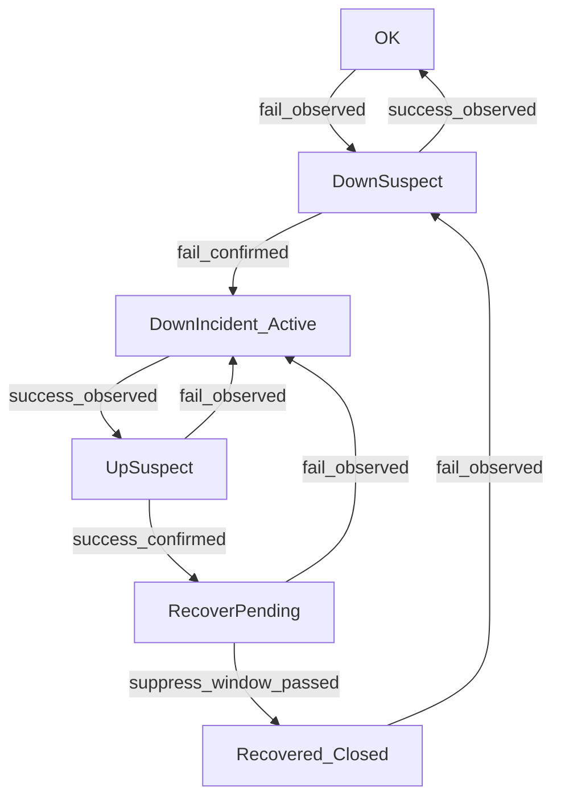

# 告警体系设计（分组 / 去重 / 降噪）

本文档基于当前项目的告警触发与发送实现，设计一套可落地的 **告警分组、去重、降噪** 体系。设计目标是：**每个监控宕机/恢复事件独立通知（per-monitor）**，同时在记录层与发送层做严格去重，并通过抑制抖动与短暂异常来降噪。

## 1. 当前实现梳理（设计依据）

### 1.1 触发链路（监控 -> 写告警 -> 发告警）

- **监控检测入口**：`backend/internal/service/monitor_service.go` 的 `RunMonitorOnce(monitorId, fromOneHand)`  
  - 执行 HTTP 探测（`backend/pkg/monitor/monitor.go` 的 `HTTPMonitor`），写入 `monitor_history`，并更新 `monitor` 表状态（含 `last_status`）。
  - 当检测结果为宕机（`newStatus == 2`）时，会异步调用：
    - `backend/internal/service/alert_service.go::CreateAlert(monitor)` 创建告警记录
    - `backend/internal/service/alert_service.go::SendUnsentAlert()` 立即发送（而不是仅依赖定时任务）
  - 当从宕机恢复（`newStatus == 1 && monitor.LastStatus == 2`）时，会异步调用：
    - `backend/internal/service/alert_service.go::CreateRecoveryAlert(monitor)` 创建恢复通知记录（`alert_sub_type=2`）
    - `SendUnsentAlert()` 立即发送

### 1.2 告警数据模型与发送模型

- **告警记录模型**：`backend/internal/model/alert.go`
  - 关键字段：`monitor_id`、`user_id`、`alert_type`（邮箱/钉钉）、`alert_sub_type`（宕机/恢复）、`status`（未发/已发/失败）、`content`、`send_time`、`create_time`、`update_time`
- **告警记录写入**：`backend/internal/dao/alert_dao.go::CreateAlert`
  - 当前策略为 **强制新增**：`DB.Create(alert)`，没有唯一约束或 upsert 去重。
- **告警发送**：`backend/internal/service/alert_service.go::SendUnsentAlert`
  - 拉取 `status=0` 的记录（`backend/internal/dao/alert_dao.go::GetUnsentAlert`），并发发送后更新 `status=1/2`（`UpdateAlertStatus`）。
  - 当前实现没有“原子领取/锁定（claim）”机制：若多个 goroutine/触发路径同时调用 `SendUnsentAlert()`，同一条 `status=0` 记录可能被重复发送。

### 1.3 现状问题总结（需要解决的“噪声来源”）

- **记录层缺少去重**：持续宕机期间如果多次触发写入（例如逻辑变更/并发边界/手动触发），会产生多条近似重复记录，导致记录列表与通知都变“吵”。
- **发送层可能重复投递**：并发 `SendUnsentAlert()` 缺少 claim，会出现同一记录多次投递的风险。
- **短暂异常与抖动（flapping）**：网络抖动或短暂 5xx 会造成“宕机/恢复”频繁切换，从而刷屏。

## 2. 设计目标与原则

### 2.1 分组（Grouping）

- **分组粒度**：以“单个监控项的宕机/恢复事件”为最小分组单位（Incident）。
- **通知方式**：每个 incident 单独发送（不做跨监控/跨用户摘要合并），但会在同一 incident 内对重复观测进行聚合（只更新计数/last_seen，不重复发送）。

### 2.2 去重（Dedup）

去重分两层：

- **记录层去重**：同一 incident 生命周期内，不重复插入“新的告警行”，而是 **更新同一行**（计数、最后一次发生时间、内容等）。
- **发送层去重**：同一条待发送记录必须通过 **原子 claim** 才能进入发送，从根源避免并发重复投递。

### 2.3 降噪（Noise Reduction）

降噪分三类策略：

- **Debounce（确认阈值）**：连续失败/成功达到阈值后才触发宕机/恢复事件。
- **Flapping suppression（抖动压制）**：短暂恢复后很快再次宕机，抑制恢复通知或合并回原宕机 incident。
- **Rate limit（兜底限速）**：对单监控/单用户在窗口内的告警数量做上限，防止极端情况刷屏。

## 3. Incident 模型：生命周期、分组 Key、状态机

### 3.1 Incident 定义（与当前字段对齐）

- **宕机告警**：`alert_sub_type = 1`
- **恢复通知**：`alert_sub_type = 2`

建议将“incident”显式化，不再把 “一条 alert 记录 = 一次发送” 作为唯一语义，而是：

- `alert` 记录代表一个 incident（宕机或恢复）在其生命周期中的聚合视图：
  - `first_seen_at`：首次确认触发时间
  - `last_seen_at`：最后一次观测到该状态的时间
  - `occur_count`：该状态重复观测次数
  - `status`：发送状态（未发送/处理中/已发送/失败）

### 3.2 分组与唯一性：dedup key 与 incident_id

为了既能“同一宕机只报一次”，又能“恢复后下一次宕机算新事件”，需要两个层次的标识：

- **incident_key（稳定指纹）**：用于同一生命周期内的去重归并  
推荐构造：`incident_key = hash(user_id, monitor_id, alert_sub_type, incident_seq)`  
其中 `incident_seq` 是该监控的宕机序列号（每发生一次“真正的宕机事件”递增）。
- **incident_seq（生命周期版本号）**：用于区分多次宕机生命周期  
  - 当监控从 **正常/暂停 -> 宕机** 并且通过 debounce 确认后：`incident_seq++`（开启新宕机生命周期）
  - 当监控从 **宕机 -> 正常** 并通过 debounce 确认后：为当前宕机生命周期生成一条恢复事件（可复用同一 `incident_seq`），并关闭宕机事件

> 说明：当前项目有 `monitor.last_status`（`backend/internal/model/monitor.go`，写入逻辑在 `backend/internal/dao/monitor_dao.go::UpdateMonitorStatusWithLast`），它能判断“宕机->恢复”的一次切换，但不足以支持 debounce、抖动压制与 incident 聚合；因此需要在告警侧引入 `incident_seq/first_seen/last_seen/occur_count` 等概念。

### 3.3 状态机（推荐）

用一个小状态机把“分组/去重/降噪”统一起来：

- **DownSuspect / UpSuspect**：用于 debounce（确认阈值），避免一次抖动就触发告警/恢复。
- **DownIncident_Active**：宕机生命周期进行中；仅允许在首次确认时触发一次“宕机告警”，后续只聚合观测。
- **RecoverPending**：恢复确认后进入抖动压制窗口；窗口内若再次失败，则取消恢复并回到宕机生命周期。
- **Recovered_Closed**：宕机生命周期关闭；下一次宕机会开启新的 `incident_seq`。

## 4. 去重设计（记录层 + 发送层）

### 4.1 记录层去重：同一 incident 用 upsert 聚合

目标：同一 incident 生命周期内只维护一条“事件聚合记录”，不要因为重复观测/并发触发产生多行。

推荐写入语义（宕机 incident 为例，`alert_sub_type=1`）：

- **首次确认宕机**（从状态机输出 `fail_confirmed` 且当前未处于 `DownIncident_Active`）：
  - `incident_seq++`
  - 插入或 upsert 一条宕机事件行：
    - `first_seen_at=now`，`last_seen_at=now`，`occur_count=1`
    - `status=0`（待发送）
  - 允许进入待发送队列（发一次宕机通知）
- **宕机持续观测**（仍处于 `DownIncident_Active`）：
  - upsert 更新同一行：
    - `last_seen_at=now`，`occur_count += 1`
    - 可更新 `content`（例如补充最新错误信息）
  - **不进入待发送**（默认不重复提醒）

恢复事件（`alert_sub_type=2`）同理：只在“恢复最终确认且通过抑制窗口”后生成一次记录并发送一次。

> 与现状对齐：当前 `backend/internal/dao/alert_dao.go::CreateAlert` 是 `DB.Create` 强制新增；落地本设计需改为 upsert（按唯一键更新/插入），或引入唯一索引并使用数据库 on conflict/upsert。

### 4.2 发送层去重：Claim（原子领取）避免并发重复投递

现状风险：`backend/internal/service/monitor_service.go` 在宕机/恢复时直接调用 `SendUnsentAlert()`；一旦多处并发调用 `SendUnsentAlert()`，同一条 `status=0` 记录可能被重复发送。

推荐引入 **claim 机制**（二选一）：

- **方案 A：增加 processing 状态（推荐）**
  - `status` 增加 `3 = processing`
  - DAO 提供 `ClaimUnsentAlerts(limit)`：用原子更新把一批 `status=0` 的记录变成 `status=3` 并设置 `locked_at=now`，仅返回/发送被领取的记录
  - 发送成功：`status=1, send_time=now`
  - 发送失败：`status=2, last_error=...`（可选）
  - 并加“锁超时回收”：若 `status=3` 且 `locked_at` 超过 TTL（例如 2 分钟），允许重新 claim
- **方案 B：乐观锁（需要 version 字段）**
  - 增加 `version`，发送前 `UPDATE ... WHERE id=? AND status=0 AND version=?`
  - 更新成功才发送，否则跳过

> 与现状对齐：当前 `SendUnsentAlert()` 是先 `GetUnsentAlert()` 再并发发送；落地 claim 后，`GetUnsentAlert()` 应替换为 `ClaimUnsentAlerts()`，并把并发发送建立在“已被 claim 的集合”之上。

## 5. 降噪设计（Debounce / Flapping / Rate limit）

### 5.1 Debounce：宕机确认（Down confirm）

不在首次失败就触发宕机事件，要求满足以下之一：

- **连续失败次数阈值**：`down_confirm_count`  
  - 默认建议：2
- **持续失败时间阈值**：`down_confirm_seconds`  
  - 默认建议：`max(20s, 2 * frequency)`

推荐用 Redis 维护 per-monitor 的“疑似计数与状态机”，避免每次在线查询 `monitor_history`。

### 5.2 Debounce：恢复确认（Up confirm）

同理，恢复也应满足：

- `up_confirm_count`：默认建议 2
- `up_confirm_seconds`：默认建议 `max(20s, 2 * frequency)`

### 5.3 Flapping suppression：抖动压制窗口

定义 `reopen_suppress_seconds`（默认建议 `max(60s, 5 * frequency)`），用于处理：

- 宕机恢复后很快再次宕机（网络抖动/探测不稳定）

推荐默认策略（噪声更低，语义更稳定）：

- 恢复确认后先进入 `RecoverPending`，**延迟发送恢复通知**；
- 若 `reopen_suppress_seconds` 内再次失败并确认宕机：取消恢复，回到 `DownIncident_Active`，并持续聚合（不递增 `incident_seq`）；
- 只有压制窗口结束仍保持正常，才真正发送恢复通知，并把 incident 关闭。

### 5.4 Rate limit：兜底限速

为防止极端情况刷屏（例如探测目标持续抖动、外部依赖异常），加兜底限速（默认建议）：

- `max_notifications_per_monitor_per_hour = 2`
- `max_notifications_per_user_per_hour = 20`

限速触发后：

- 仍更新 incident 聚合字段（`occur_count/last_seen_at`），但不再发送；
- 可选：发送一条“限速提示”（仍然 per-monitor，不做跨监控摘要）。

## 6. 数据结构建议（兼容现有表）

### 6.1 `alert` 表新增字段（建议）

在保留现有字段 `content/status/send_time/alert_type/alert_sub_type` 的前提下，建议新增：

- `incident_seq`（int）：生命周期版本号
- `incident_key`（varchar）：稳定指纹（可选，但推荐）
- `first_seen_at`（datetime）
- `last_seen_at`（datetime）
- `occur_count`（int，默认 1）
- `locked_at`（datetime，可选，用于 claim）
- `last_error`（varchar/text，可选，用于发送失败原因）

并建议把 `status` 扩展为：

- 0：待发送
- 1：已发送
- 2：发送失败
- 3：发送中（processing，claim 用）

### 6.2 唯一约束（决定记录层去重的根基）

建议至少保证同一生命周期内唯一：

- `UNIQUE(user_id, monitor_id, alert_sub_type, incident_seq)`

或：

- `UNIQUE(incident_key)`

## 7. 与现有代码的对齐改造点（后续实现指引）

> 本节是“从现有代码走向该设计”的落地路线图（不在本文档中直接改代码）。

### 7.1 触发入口：从“切换即告警”转为“状态机输出事件”

当前 `backend/internal/service/monitor_service.go::RunMonitorOnce` 通过 `newStatus` 与 `monitor.LastStatus` 判断宕机/恢复，并直接调用 `CreateAlert/CreateRecoveryAlert`。

落地本设计后，建议在 `RunMonitorOnce` 中：

- 把本次观测结果（success/fail + errorMsg + responseTime + now）交给一个告警判定器（state machine）；
- 判定器输出“事件类型”（首次确认宕机/持续宕机/恢复pending/恢复确认/取消恢复/关闭事件）；
- 只有当输出为“首次确认宕机”或“恢复最终确认”时，才进入“创建待发送记录”的逻辑。

### 7.2 记录写入：把 `CreateAlert/CreateRecoveryAlert` 改为 Upsert

当前 `backend/internal/service/alert_service.go::CreateAlert` / `CreateRecoveryAlert` 都是“构造 content -> dao.CreateAlert 强制新增”。

落地本设计后应改为：

- `UpsertIncidentAlert(userId, monitorId, alertSubType, incidentSeq, ...)`
- 对持续观测只更新 `last_seen_at/occur_count/content`，不要生成新行、不要重复进入待发送。

### 7.3 发送：`SendUnsentAlert` 先 claim 再发送

当前 `backend/internal/service/alert_service.go::SendUnsentAlert` 的流程是：

- `dao.GetUnsentAlert()` 拉取 `status=0`
- 并发发送后更新 `status`

落地本设计后应改为：

- `dao.ClaimUnsentAlerts(limit)` 原子领取 `status=0` -> `status=3`
- 只发送被领取的记录
- 发送结果写回 `status=1/2`，并处理 `status=3` 超时回收

## 8. 通知模板建议（保持 per-monitor）

### 8.1 宕机告警（Down）

- 标题：`【监控告警】<MonitorName> 宕机`
- 正文建议包含：
  - 监控名称、URL
  - 首次确认时间（`first_seen_at`）
  - 最近一次观测（`last_seen_at`）
  - 累计次数（`occur_count`）
  - 最近错误信息（如有）

### 8.2 恢复通知（Up）

- 标题：`【恢复通知】<MonitorName> 已恢复`
- 正文建议包含：
  - 宕机开始（down 的 `first_seen_at`）
  - 恢复确认时间（up 的 `first_seen_at`）
  - 宕机持续时长

## 9. 验收用例（实现后必须通过）

### 9.1 基础用例

- **单次宕机**：连续失败达到阈值 -> 只发送 1 条宕机告警；持续失败期间不重复发送，只更新 `occur_count/last_seen_at`。
- **恢复**：连续成功达到阈值 -> 只发送 1 条恢复通知；持续正常期间不重复发送。

### 9.2 抖动用例（降噪核心）

- **短暂异常**：失败 1 次后恢复 -> 不触发宕机告警（debounce 生效）。
- **宕机-短暂恢复-再宕机**（在 `reopen_suppress_seconds` 内）：
  - 不发送恢复通知（恢复处于 pending 且最终取消）
  - 宕机 `incident_seq` 不递增（推荐默认策略），只聚合更新

### 9.3 并发与一致性

- **并发发送**：同时触发多次 `SendUnsentAlert()`，同一条待发送记录最多被 claim 一次，不会重复投递。
- **发送失败重试**：失败记录可被再次 claim 并重试，但任何时刻同一记录最多被一个发送者处理。

